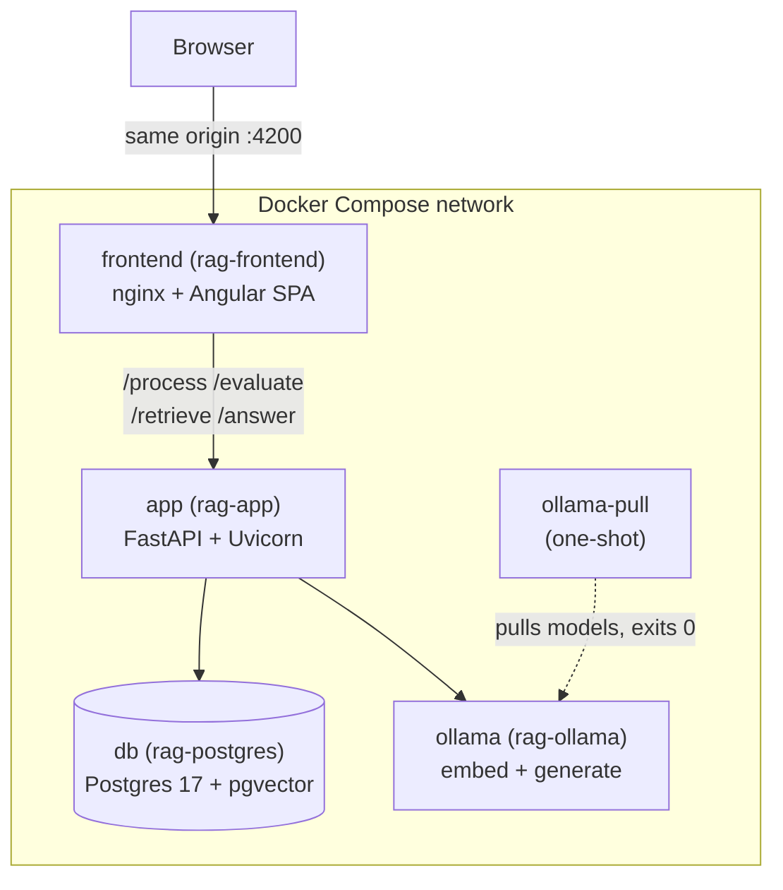
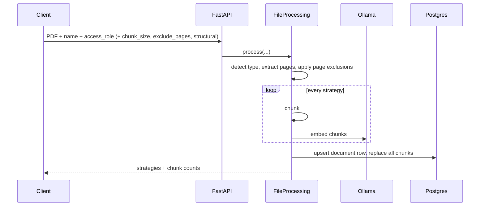
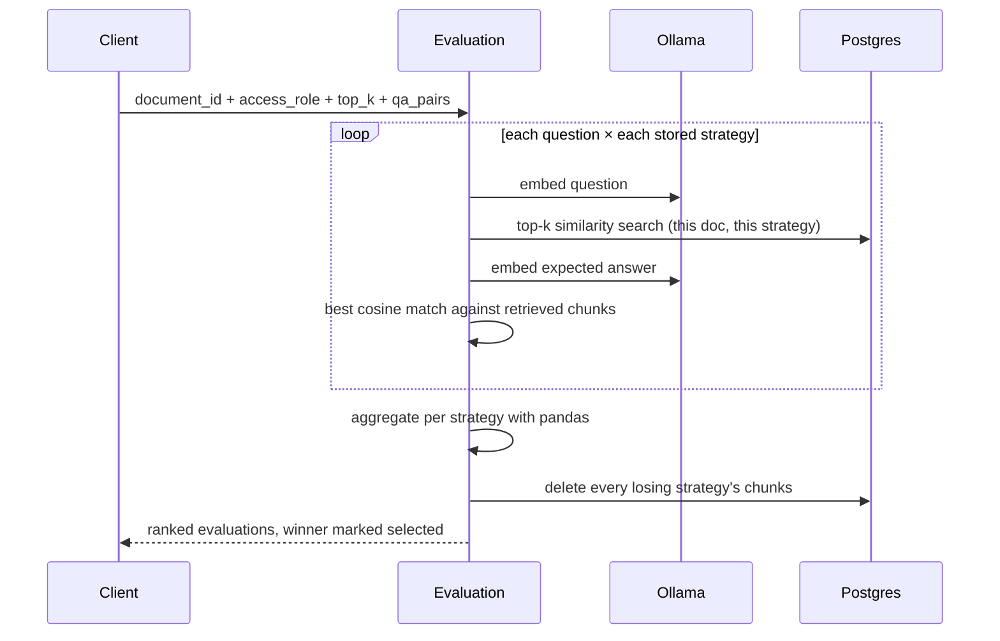
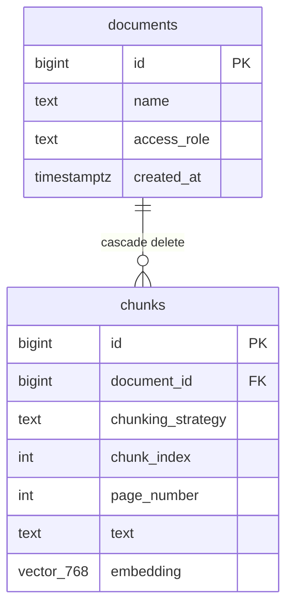

# Architecture

How the RAG Assistant is put together, and why. [README.md](../README.md) is the
user-facing description of what the system does; this file is the internal view —
boundaries, contracts, data flow, and the decisions behind them.

**Scope:** what exists today. Anything not yet built is marked *(planned)* and
carries its requirement ID from [Requirements.md](Requirements.md).

---

## 1. Shape of the system

Four processes, one command, no external accounts. Everything — including both
models — runs locally.

| Service | Container | Role | Health |
| --- | --- | --- | --- |
| `frontend` | `rag-frontend` | Serves the compiled SPA; reverse-proxies the four API paths to `app:8000` | nginx serves `/` |
| `app` | `rag-app` | The whole RAG pipeline behind four endpoints | `GET /openapi.json` |
| `db` | `rag-postgres` | Document and chunk storage, vector search | `pg_isready` |
| `ollama` | `rag-ollama` | Embeddings **and** generation — the only service doing tensor maths | `ollama list` |
| `ollama-pull` | — | Pulls both models once, then exits | exit 0 |

**Two rules hold this together.** Services address each other by *compose service
name* on the internal network — never `localhost`, never a hardcoded URL. And the
browser only ever talks to one origin, because nginx proxies the API paths; that
is why there is no CORS configuration anywhere in the codebase.

## 2. Pipeline stages

The domain is a pipeline, and the code is organised by stage. Each stage sits
behind a narrow interface so an implementation can be swapped without touching
its neighbours — which is what makes strategies comparable in evals.

| Stage | Interface | Implementations | Location |
| --- | --- | --- | --- |
| Extraction | — (a method on the processing service) | PyMuPDF page-by-page text + stats | `services/file_processing.py` |
| Chunking | `Chunker` | `fixed`, `semantic`, `structural` | `services/chunking/` |
| Embedding | `Embedder` | Ollama `nomic-embed-text` (768-dim) | `services/embedding/` |
| Storage | `PostgresStorage` | Postgres + pgvector | `services/storage/` |
| Retrieval | — (a service class) | pgvector cosine + role filter | `services/retrieval.py` |
| Generation | `LLMClient` | Ollama (`gemma2:2b` by default), plus the answer-faithfulness metric | `services/generation/` |
| Evaluation | — (a service class) | Labelled retrieval eval over Q&A | `services/evaluation.py` |

**Service layout follows one rule from [CLAUDE.md](../CLAUDE.md): one service class
per endpoint, not a module per step.** Everything `/process` does — detect,
extract, exclude pages, chunk every way, embed, store — is a method on
`FileProcessing`, most of them private. The class's public surface is `process()`.
A stage only becomes its own module when it has several interchangeable
implementations to hold (chunking, embedding, generation), because that is what an
interface is *for*.

### The three chunking strategies

They exist to be compared, and they fail in different places on purpose:

- **fixed** — windows of N words, ignoring every boundary. The structure-blind
  baseline the others have to beat. Cheap and deterministic.
- **semantic** — embeds each sentence and breaks where consecutive sentences drift
  apart in meaning. Finds topic shifts nothing marks up; costs one embedding per
  sentence at ingest.
- **structural** — breaks on the markers the document already carries, matched by
  regex over line starts. Needs no embeddings at all. Sections are bounded either
  side: a too-short one merges forward, an over-long one splits at paragraph, then
  sentence, then word boundaries. A document with no markers falls back to
  paragraphs.

## 3. Request flows

### `POST /process` — ingest, without judgement

The design decision worth naming: **`/process` scores nothing.** The caller does
not pick a strategy and no strategy is dropped. Every strategy's chunks are stored
against one `documents` row, numbered from 0 *per strategy*. Ingest stays cheap
and repeatable, and scoring becomes a separate, re-runnable stage.

### `POST /evaluate` — score, then prune

`answer_similarity` — the mean across questions of each question's best match — is
the ranking metric. `hit_rate` is the fraction of questions matched above a
threshold, reported but not used to rank.

**Why embedding similarity and not an LLM judge?** The Q&A pairs are authored
ahead of time, outside the system. So the eval itself makes no LLM calls: it
scores with the same local embedding model used everywhere else. The pipeline
stays fully open-source and free of per-call cost, and `/evaluate` stays a cheap,
deterministic, repeatable scorer. The LLM-judge alternative is scoped as an
*offline* eval, never an endpoint — see `REQ-EVL-05`.

### `POST /retrieve` and `POST /answer`

`/retrieve` embeds the query and runs a pgvector cosine search filtered by
`access_role` (and optionally by strategy). `/answer` does the same, then builds a
prompt grounding the model in those chunks — the *augment* step — and returns the
generated answer with its sources. `/answer` is the only endpoint that calls the
generation model.

Whether the answer is actually *grounded* in those sources is not taken on trust.
`services/generation/faithfulness.py` scores an answer's sentence-level claims
against its context sentences, and `evals/answer_faithfulness_eval.py` runs it
offline over three conditions — the real context, a distractor context, and no
context — so the measure is shown to separate grounded answers from ungrounded
ones rather than just producing a number (`REQ-EVL-06`). The metric is a library,
not a request-path step: `/answer` never scores itself.

## 4. Data model

Two tables. The interesting design is in the constraints.

- `UNIQUE (name, access_role)` on `documents` — **re-processing replaces, it never
  duplicates.** One row per document, because the chunks already record which
  strategy produced them; nothing needs a second row.
- `UNIQUE (document_id, chunking_strategy, chunk_index)` on `chunks` — chunks are
  numbered per strategy, which is what lets several strategies live under one
  document at once and get deleted in bulk by strategy.
- `vector(768)` matches `nomic-embed-text`. pgvector columns are fixed-dimension,
  so **the column is coupled to the model** — a different-dimension model needs a
  schema change today (`REQ-EMB-02`).
- HNSW index with `vector_cosine_ops` — cosine is the metric retrieval ranks by,
  and the index has to match.

**Access control is a column, enforced in the application layer.** Every read
filters on `access_role`. It's deliberately the simplest thing that works; when
a document needs several roles the column becomes a `document_roles` join table
(`REQ-SEC-02`), and the schema already says so.

## 5. Contracts

All structured input and output crosses module boundaries as Pydantic models, not
raw dicts, and they live in dedicated folders — `backend/dtos/requests/` and
`backend/dtos/responses/` — never inline in a route.

Route handlers are thin. Each one validates, delegates to exactly one service, and
returns. Two dependencies are injected per request:

- `get_storage()` — one connection per request, closed after. Simple and
  thread-safe.
- `get_llm()` — the Ollama client built from environment.

Both exist so tests can override them with fakes, which is why 164 of the 170
tests run with no database and no network.

One nuance in `/process`: three of its fields arrive as JSON strings inside a
multipart form, so they are validated by hand and their errors re-raised as a 422
whose `loc` names the offending field. Otherwise a bad regex would surface as an
unattributed "Input should be an object".

## 6. Frontend

An Angular 20 SPA of standalone components, two routes:

- `core/` — the API client, DTO types mirroring the backend responses, and a
  session service holding the access role that every request carries.
- `user/` — the **Ask** tab: question in, answer with cited sources or the raw
  ranked chunks out.
- `admin/` — the **Admin** tab: upload and process a PDF, then evaluate the stored
  strategies against Q&A pairs. The upload pre-fills the document id for the
  evaluate form, because that is the actual workflow.

In the stack, nginx serves the built bundle and proxies the API paths. In
development, the Angular dev server proxies the same four paths. Same-origin in
both, so the deployed and the development topology don't diverge.

## 7. Decision record

Short entries, kept because the reasoning matters more than the choice.

| # | Decision | Why | Cost accepted |
| --- | --- | --- | --- |
| D1 | Everything local (Ollama for both models, Postgres for vectors) | No API keys, no per-call cost, runs on a laptop | A small local model is a weaker generator and a weaker judge |
| D2 | Chunk every strategy at ingest; score in a separate endpoint | Ingest stays cheap and deterministic; a document can be re-scored with a new question set without re-chunking | Storage holds several strategies until `/evaluate` prunes |
| D3 | Rank strategies by embedding similarity, not an LLM judge | Deterministic, free, repeatable; Q&A pairs are authored externally anyway | Can't see answer *quality* — only retrieval quality |
| D4 | `/evaluate` deletes the losing strategies | The document ends in one clean state; retrieval isn't polluted by dead chunks | Re-comparing means re-processing the document |
| D5 | One service class per endpoint | Keeps the call graph obvious; avoids a module-per-step maze | A large service class, mitigated by private methods |
| D6 | Single `access_role` column | Simplest thing that enforces the requirement | Needs a join table for multi-role documents |
| D7 | Frontend proxies the API (single origin) | No CORS configuration to get wrong, in any environment | The frontend container must know the API paths |
| D8 | pgvector over a dedicated vector database | One datastore, one backup story, SQL joins to document metadata | Fixed-dimension column; HNSW tuning is manual |
| D9 | Rank-aware metrics are reported, not used to select the winner | Adding them alongside `answer_similarity` measures the ranking without silently changing which strategy `/evaluate` keeps; the two changes stay separable and reviewable | The eval shows the kept strategy is sometimes *not* the best-ranked one, so the selection rule is now a known open question rather than an answered one |
| D10 | Measure answer faithfulness with embedding similarity, not an LLM judge | Same reasoning as D3, applied to generation: deterministic, free, offline, and unblocked by the judge-model decision `REQ-EVL-05` is still waiting on | Similarity is not entailment — a claim that contradicts the context while resembling it scores as supported, and an honest "I don't know" scores as unfaithful |
| D11 | Score claims against context **sentences**, not whole chunks | A chunk embedding is dominated by its overall topic, so chunk-level matching passed invented on-topic claims; the first version of the metric could not separate grounded from ungrounded answers at all | One embedding per context sentence instead of per chunk, and a sentence→chunk map to keep citations scorable |

## 8. Extension points

Where new work attaches, and what it must not disturb:

- **A new chunking strategy** — implement `Chunker`, register it in the strategy
  set, add it to the comparison eval. `/process` picks it up; `/evaluate` starts
  scoring it. Nothing else changes. (`REQ-CHK-06`, `REQ-CHK-07`)
- **A new extraction source** — OCR, another file type, or a scraped URL plugs in
  ahead of chunking and must produce the same per-page structure.
  (`REQ-EXT-03`–`05`)
- **A different embedding model** — swap by environment if it is 768-dim;
  otherwise the schema needs the change described in `REQ-EMB-02`. Note the
  faithfulness support threshold is calibrated per embedding model: re-run the
  eval and read its `threshold_sweep` before trusting the old cut.
- **A different generation model or prompt** — the faithfulness eval generates
  through the shipped `Answering.build_prompt`, so re-running it measures the
  change directly. The client is seeded, but generation is not bit-reproducible:
  compare the *ordering* across the eval's conditions, not single digits.
- **Richer eval metrics** — rank-aware metrics now attach to the same labelled
  Q&A set `/evaluate` already takes (`REQ-EVL-04`, shipped); a further metric adds
  a function to `services/rank_metrics.py` and a column to the aggregation, and
  must stay out of the selection rule. Answer-quality metrics attach instead to
  `services/generation/faithfulness.py` and its offline eval (`REQ-EVL-06`). The
  LLM-judge eval stays *offline* in `backend/evals/`, never in the request path
  (`REQ-EVL-05`).

The constraint that governs all of them: **a stage isn't done until an eval
measures it.** The interfaces exist to keep that comparison honest — same data,
same harness, one variable changed.
