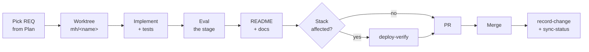
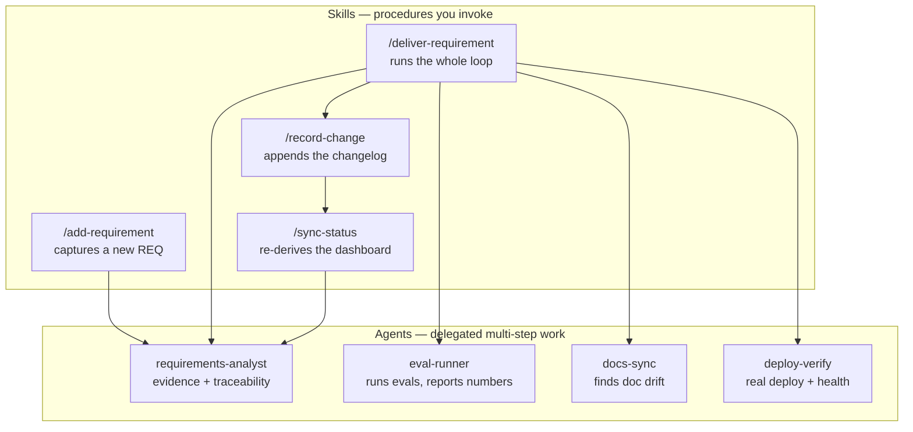

# Delivery Approach

How work gets from a requirement to merged code in this repository — the loop, the
gates, and the skills and agents that run it.

[Requirements.md](Requirements.md) says *what*. [Plan.md](Plan.md) says *in what
order*. This file says *how*, and it is the contract the automation implements.

---

## 1. Principles

**Measured, not asserted.** A pipeline stage isn't done until a real eval measures
it. When a change claims something improved, it cites eval output — never a
reading of the code. Prefer comparative evals: the new strategy against the
existing ones, same data, one variable changed.

**Automation over reminders.** A check that must happen every time is a hook, not
a paragraph someone remembers. Prose in [CLAUDE.md](../CLAUDE.md) is reserved for
judgment. When a new rule appears, it gets routed:

| The rule is… | Its home |
| --- | --- |
| A mechanical every-time check (format, lint, scan, gate) | A **hook** in `.claude/settings.json` or `.githooks/` |
| A procedure for a particular kind of task | A **skill** in `.claude/skills/` |
| Delegated multi-step work with its own context | An **agent** in `.claude/agents/` |
| A judgment call that needs applying while working | **CLAUDE.md** prose |

**Evidence over status fields.** A requirement's status is derived from what exists
in the repository — a test, an eval artifact, a passing deploy — not from someone
marking it done. That's why `sync-status` re-derives rather than edits.

**Small, whole increments.** One requirement per branch, per PR, finished:
code + test + eval + README + changelog. Not a stack of half-done stages.

## 2. The delivery loop



Ten steps, in order:

1. **Pick a requirement** from the earliest open phase in [Plan.md](Plan.md).
   Nothing gets built that doesn't have an ID.
2. **Confirm the acceptance criterion is testable.** If it isn't, fix the
   requirement first (`add-requirement`) — a criterion you can't check is a
   requirement you can't finish.
3. **Branch into a worktree** under `.claude/worktrees/<name>/`, on a
   `mh/<kebab-case-name>` branch. Never an agent name in the branch.
4. **Implement**, following the conventions: Pydantic DTOs in their folders,
   processing in `services/`, one service class per endpoint, narrowest access,
   match the surrounding style.
5. **Test alongside.** Fast and offline by default; anything needing Postgres or
   the network is marked `integration`. A bug fix ships with a test that fails
   without it.
6. **Eval the stage** if it's a pipeline stage — comparative, reproducible, with
   the result artifact committed. This is the step that most often gets skipped
   and is the one the project exists for.
7. **Update the README in the same change** — endpoint, architecture, dependency,
   env var, or setup change. Shipped work moves out of Roadmap.
8. **Verify the deploy** with the `deploy-verify` agent if the change touches a
   Dockerfile, nginx config, `docker-compose.yml`, backend deps, `.env.example`,
   the DB schema, or app code.
9. **PR as `mh2005in`.** No Claude attribution, no co-author trailer, no CLAUDE.md
   reference in the message.
10. **After merge:** `record-change` appends the changelog entry, `sync-status`
    re-derives the dashboard, and the post-merge hook removes the worktree.

## 3. Definition of Done

A requirement is `Done` only when all of these hold. This is the checklist
`deliver-requirement` walks and `requirements-analyst` audits:

- [ ] The acceptance criterion in [Requirements.md](Requirements.md) is observably met
- [ ] Tests cover it, in the right tier (fast/offline by default, `integration` marked)
- [ ] A pipeline stage has a **real eval** with a committed, regenerable result
- [ ] `ruff format`, `ruff check`, `mypy` are clean
- [ ] The README reflects it, and it's out of Roadmap
- [ ] `deploy-verify` passed, if the change is stack-affecting
- [ ] The evidence column in Requirements.md points at something that exists
- [ ] A changelog entry records it
- [ ] No secret, PII, source document, scraped content, embedding, or DB dump committed

Anything short of that is `Partial`, with the gap written down. "Nearly done" is
not a status.

## 4. What runs automatically

These already fire without being asked — don't re-check them by hand:

| Trigger | What happens | Where |
| --- | --- | --- |
| After every file edit | `ruff format` + `ruff check --fix` | `.claude/settings.json` |
| End of every turn | `mypy` | `.claude/settings.json` |
| On commit | Author is `mh2005in` → gitleaks on staged diff → fast pytest | `.githooks/pre-commit` |
| After a clean `deploy-verify` | Removes caches, dangling images, build cache, scratchpad | `.claude/hooks/deploy-verify-cleanup.sh` |
| On merge into `main` | Removes merged worktrees | `.githooks/post-merge` |
| PR touching `backend/**` | `ruff format --check`, `ruff check`, `mypy`, fast pytest in CI | `.github/workflows/backend-ci.yml` |
| PR touching `frontend/**` | Mocked Playwright E2E in CI | `.github/workflows/frontend-e2e.yml` |

Enable the git hooks in a fresh clone:

```bash
git config core.hooksPath .githooks
```

Between them, the local hooks and the two CI workflows mean the same gates apply
whether or not a contributor has the hooks configured: `backend-ci` re-runs the
format, lint, type and fast-test gates on every backend PR, and `frontend-e2e`
runs the mocked Playwright suite on every frontend PR.

## 5. The skills and agents, and how they fit together

Four skills drive the loop; four agents do the delegated work inside it.



### Skills

| Skill | Use it when | What it does |
| --- | --- | --- |
| **`deliver-requirement`** | Building anything with a REQ id | Walks the ten-step loop end to end, calling the agents at the right points and stopping at each gate that fails |
| **`add-requirement`** | A new need appears, or an existing one is wrong | Assigns the next ID in the right stage, writes a *testable* acceptance criterion, places it in a phase, and refuses vague statements |
| **`sync-status`** | After a merge, or when the dashboard looks stale | Re-derives every status from evidence, recomputes the counts, and reports what changed and why |
| **`record-change`** | After a merge | Appends a Keep-a-Changelog entry from the merged commits, with the REQ ids it closed |

### Agents

| Agent | Delegated job | Tools |
| --- | --- | --- |
| **`requirements-analyst`** | Reads code, tests and eval artifacts to verify whether a requirement's evidence actually supports its status. Read-only — it reports, it doesn't edit | Read, Grep, Glob, Bash |
| **`eval-runner`** | Runs the eval suite and the test tiers, reports the numbers, and compares against the committed artifacts to spot regressions | Bash, Read, Glob, Grep |
| **`docs-sync`** | Cross-checks README, CLAUDE.md and the `.claude/` documents against the repository and against each other; reports drift | Read, Grep, Glob, Bash |
| **`deploy-verify`** | Builds the stack, waits for all four healthchecks, exercises the API and the SPA, runs the stack E2E suite | Bash, Read, Glob, Grep |

**Why these four agents and not more.** Each owns a distinct kind of evidence —
requirements, measurements, documentation, deployment — which is exactly the four
things the Definition of Done asks for. Implementation itself is not delegated:
it needs the full conversation context and the CLAUDE.md conventions applied with
judgment, which is work for the main session, not a cold subagent.

### A worked pass

Delivering `REQ-QUA-06` (backend CI) would run:

1. `/deliver-requirement REQ-QUA-06`
2. → `requirements-analyst` confirms the acceptance criterion and current evidence
3. → implement the workflow, in a `mh/backend-ci` worktree
4. → `eval-runner` confirms the fast tests, lint and types are green locally
5. → README updated; not a pipeline stage, so no new eval needed
6. → not stack-affecting, so `deploy-verify` is skipped
7. → `docs-sync` checks the README and `.claude/` docs still agree
8. → PR as `mh2005in`, merge
9. → `/record-change`, then `/sync-status` flips `REQ-QUA-06` to `Done`

## 6. Guardrails

**Never weaken a gate to get green.** Don't delete or loosen a failing test, don't
`--no-verify` past the pre-commit hook, don't mark a requirement `Done` without
its evidence. Fix the cause, or say it's blocked and why.

**Data discipline.** Source documents, scraped content, embeddings and DB dumps
stay out of the repository. Secrets and PII get placeholdered before committing —
gitleaks catches secret *patterns* only, so PII is a human check every time. A
committed secret is compromised: rotate it, don't just amend.

**Worktrees are removed only after a verified merge**, never with unmerged or
uncommitted work in them, and never the `main` checkout.

**Keep this file honest.** If the loop changes, the skills and hooks change with
it in the same commit. A described process that doesn't match the automation is
worse than no description at all.
